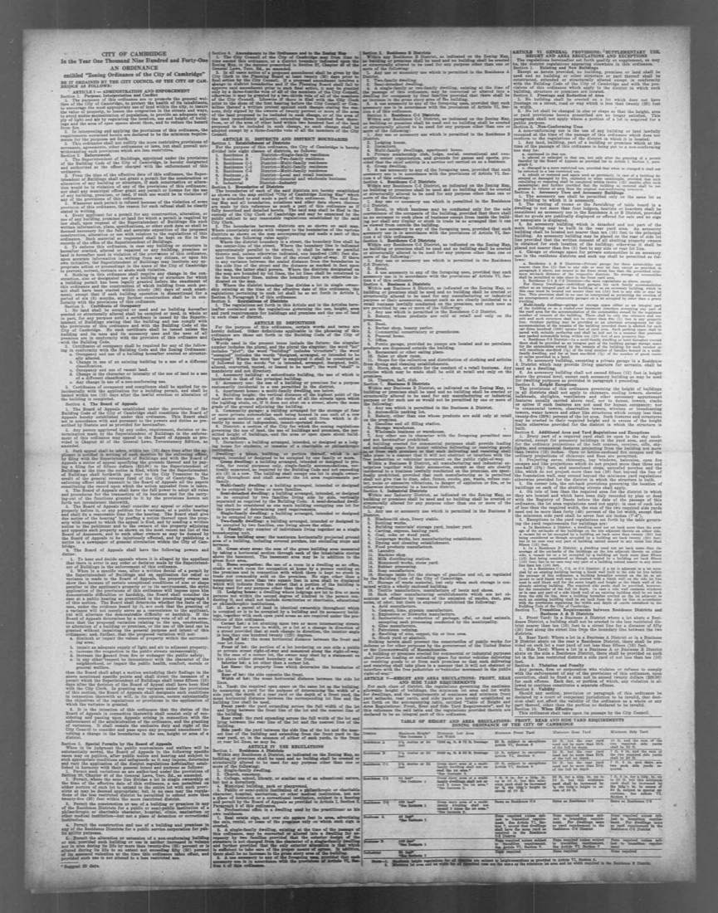
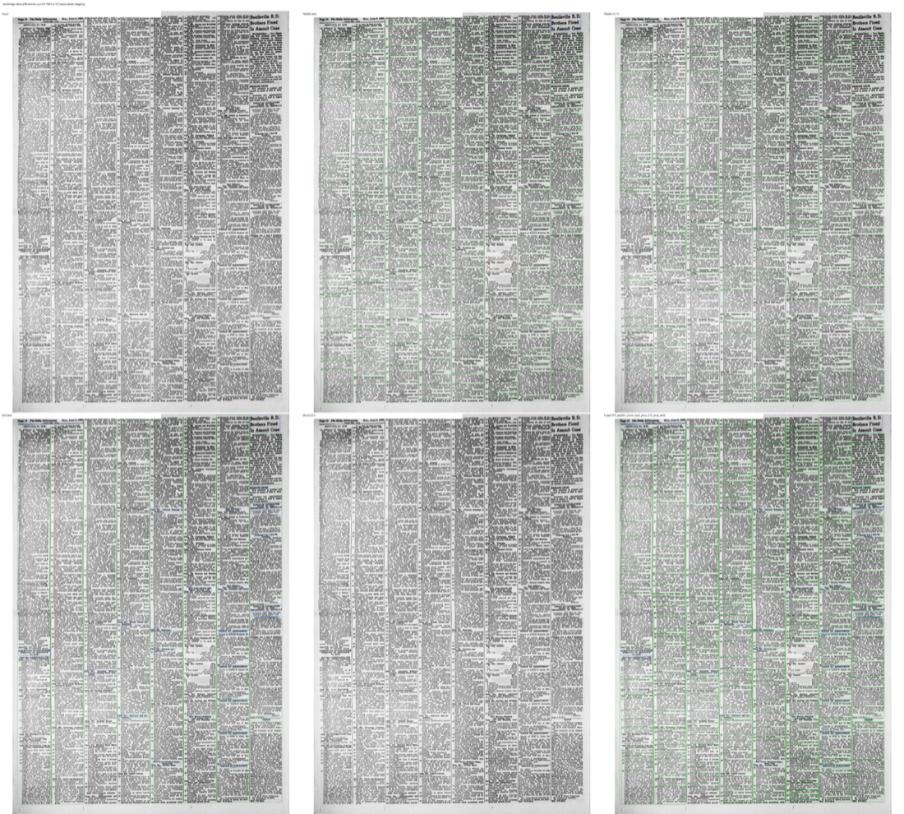
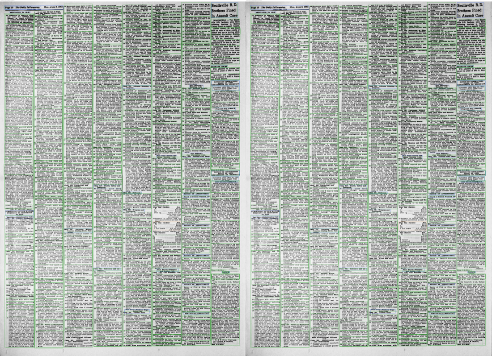
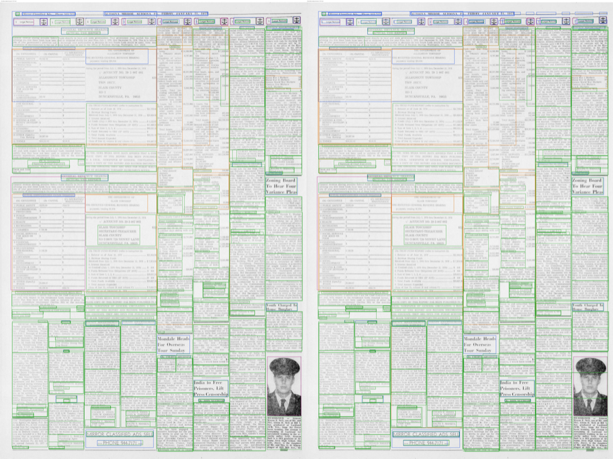
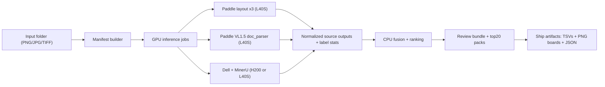

# newspaper-parsing

GPU-first newspaper layout parsing and fusion pipeline for **Paddle(4) + Dell + MinerU**.

This repository is intentionally scoped to one production flow:

- Paddle layout detectors: `PP-DocLayoutV2`, `PP-DocLayoutV3`, `PP-DocLayout_plus-L`
- Paddle VL parser: `doc_parser v1.5` (`layout_det_res` + semantic blocks from `parsing_res_list`)
- Dell American Stories layout parser
- MinerU2.5 layout parser
- Cross-model fusion with anti-noise gating and review pack generation

No other parser families are in the active path.

## Why this repo exists

- Run the full parser bag from a folder of newspaper PNGs/TIFFs.
- Keep Torch usage efficient: GPU inference first, CPU fusion/review second.
- Preserve model provenance and labels (including VL1.5 semantic/table payloads).
- Produce visual artifacts you can inspect quickly (`review/pages`, `top20_informative`, `top20_miner_delta`).

## Visual walkthrough

### 1) Raw page input



### 2) Full model comparison board (Paddle4 + Dell + MinerU + fused)



### 3) Noise-control impact (before vs after fusion noise guard)



### 4) MinerU contribution view (without MinerU vs with MinerU)



## High-level pipeline



## Repository layout

- `src/newsbag/` core package (CLI, runners, fusion, review)
- `configs/pipeline.example.json` local reference config
- `configs/pipeline.torch.json` Torch reference config
- `torch/slurm/` sbatch templates + submit helpers
- `scripts/make_manifest.py` manifest generation utility
- `scripts/monitor_torch_jobs.sh` queue monitor helper
- `docs/output_layout.md` exact artifact contracts
- `docs/torch_hpc.md` Torch operational guidance

## Quick start (local)

```bash
python3 -m venv .venv
source .venv/bin/activate
pip install -e .

cp configs/pipeline.example.json configs/pipeline.local.json
# edit paths in configs/pipeline.local.json

newsbag run --config configs/pipeline.local.json
```

Create a manifest from a scan folder:

```bash
python scripts/make_manifest.py \
  --input /absolute/path/to/scans \
  --output /absolute/path/to/news_manifest.txt
```

## Quick start (Torch, recommended)

### 0) GPU preflight

```bash
cd /scratch/$USER/paddleocr_vl15/newspaper-parsing
bash torch/slurm/preflight_gpu.sh
```

### 1) Submit end-to-end from a folder

```bash
cd /scratch/$USER/paddleocr_vl15/newspaper-parsing

bash torch/slurm/submit_newsbag_from_dir.sh \
  --input-dir /scratch/$USER/paddleocr_vl15/input/your_pages \
  --recursive \
  --gpu split
```

What `--gpu split` does:

- L40S job: `paddle_layout,paddle_vl15`
- H200 job: `dell,mineru`
- CPU job: `fusion,review` (after both GPU jobs succeed)

This is the safest high-throughput default on Torch.

### 2) Monitor

```bash
cd /scratch/$USER/paddleocr_vl15/newspaper-parsing
bash scripts/monitor_torch_jobs.sh
```

## Outputs you get per run

Each run writes under:

- `/scratch/$USER/paddleocr_vl15/runs/<run_name_timestamp>/`

Key outputs:

- `outputs/sources/...` per-model normalized boxes and label aggregates
- `outputs/fusion/variant_leaderboard.tsv`
- `outputs/fusion/source_leaderboard.tsv`
- `outputs/fusion/per_page_variant_metrics.tsv`
- `review/pages/<slug>/06_board.png`
- `review/top20_informative/`
- `review/top20_miner_delta/`

For exact schemas and filenames, see `docs/output_layout.md`.

## Fusion variants

- `S1_paddle_best_single`
- `S2_dell_only`
- `S3_mineru_only`
- `P1_paddle_union4`
- `P2_paddle_union4_plus_dell`
- `P3_paddle_union4_plus_mineru`
- `P4_paddle_union4_plus_dell_plus_mineru`

Default recommended variant in Torch config:

- `P4_paddle_union4_plus_dell_plus_mineru`

## Operational notes

- Always request Torch GPUs via `--gres=gpu:<type>:1`.
- Keep fusion/review off GPU partitions (CPU job only) to avoid low-util cancellation.
- As of February 2026 on Torch, Paddle stages are most reliable on `l40s_public`; split mode handles this automatically.

## Licensing note

`MinerU` integration depends on `mineru_vl_utils` (AGPL-3.0). Confirm license compatibility for your deployment/distribution model.
