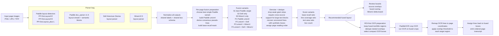

# newspaper-parsing

Corpus-scale newspaper page parsing for scanned page images. The system runs several layout parsers over the same page, normalizes their outputs into one box schema, fuses them into cleaner page structure, generates review artifacts, and produces reading-order transcripts from fused regions.

## What The System Produces

- per-model normalized layout outputs
- fused page layouts with model provenance
- review boards for quality control
- region-aligned OCR and ordered page transcripts
- corpus-level variant and source rankings

## Technical Overview


```mermaid
flowchart LR
  A["Input page images<br/>PNG / JPG / TIFF"] --> B["Parser bag"]

  subgraph B["Parser bag"]
    B1["Paddle layout detectors<br/>PP-DocLayoutV2<br/>PP-DocLayoutV3<br/>PP-DocLayout_plus-L"]
    B2["Paddle doc_parser v1.5<br/>layout stream + semantic blocks"]
    B3["Dell American Stories<br/>layout parser"]
    B4["MinerU2.5<br/>layout parser"]
  end

  B --> C["Normalize all outputs<br/>shared labels + shared box schema"]

  C --> D["Per-page fusion preparation<br/>choose best single Paddle variant<br/>build Paddle union4<br/>derive consensus pseudo-lines<br/>build base recall mask"]

  D --> E["Fusion variants<br/>S1 best Paddle single<br/>S2 Dell only<br/>S3 MinerU only<br/>P1 Paddle union4<br/>P2 union4 + Dell<br/>P3 union4 + MinerU<br/>P4 union4 + Dell + MinerU"]

  E --> F["Denoise + dedupe<br/>drop weak giant strips<br/>require cross-source support for large text blocks<br/>recover uncovered lines with synthetic boxes<br/>assign page reading order"]

  F --> G["Score variants<br/>base recall ratio<br/>line coverage ratio<br/>text area ratio<br/>box count"]

  G --> H["Recommended fused layout"]
  H --> I["Review boards<br/>source overlays<br/>fused overlay<br/>MinerU delta board"]

  H --> J["ROI-first OCR preparation<br/>keep fused text/title regions<br/>dedupe nested overlaps<br/>select compact OCR boxes"]

  J --> K["PaddleOCR crop OCR<br/>run OCR on fused crops"]
  K --> L["Remap OCR lines to page coordinates<br/>apply overlap threshold to each target region"]
  L --> M["Assign lines back to fused boxes<br/>emit ordered page transcript"]
```

## Models Used

### Layout models

- Paddle layout detectors: `PP-DocLayoutV2`, `PP-DocLayoutV3`, `PP-DocLayout_plus-L`
- Paddle semantic/layout parser: `doc_parser v1.5`
- External layout parsers: Dell American Stories layout parser, MinerU2.5

### OCR model

- PaddleOCR, invoked through the `ocr` pipeline on cropped fused regions

The OCR stage uses the fused layout as the spatial prior. OCR runs on selected page regions.

## Shared Box Representation

Every model output is rewritten into the same normalized box structure before fusion starts.

```json
{
  "source_family": "paddle|dell|mineru",
  "source_model": "variant_id",
  "source_label": "raw model label",
  "norm_label": "text|title|table|image|other",
  "bbox_xyxy": [x1, y1, x2, y2],
  "score": 0.0,
  "reading_order": null,
  "text": null
}
```

That shared structure is the core contract between parser execution, fusion, review, and transcription.

## Fusion Method

Fusion works page by page.

### Step 1: Build source sets

For each page, the system loads:

- each Paddle layout variant
- Paddle doc_parser v1.5 layout boxes
- Dell boxes
- MinerU boxes

The Paddle family is then represented in two ways:

- the best single Paddle variant for the page
- the union of all four Paddle sources: three layout detectors plus doc_parser v1.5

### Step 2: Build consensus structure

The system derives pseudo-lines from text-like regions across all sources. These pseudo-lines act as a page-level consensus proxy for text coverage.

Pseudo-line construction filters out obvious noise:

- degenerate boxes
- very large text-like boxes
- extreme full-width or full-height strips
- near-duplicate line candidates

The system also builds a base recall mask from plausible text regions. This mask is used to score fused variants against a cleaner proxy than raw source boxes.

### Step 3: Evaluate fusion variants

The system evaluates seven fusion variants:

- `S1_paddle_best_single`
- `S2_dell_only`
- `S3_mineru_only`
- `P1_paddle_union4`
- `P2_paddle_union4_plus_dell`
- `P3_paddle_union4_plus_mineru`
- `P4_paddle_union4_plus_dell_plus_mineru`

Each variant is run through the same deduplication and denoising logic before scoring.

## Overlap Handling And Layout Cleanup

The quality of the final layout comes from the overlap logic and the cleanup rules.

### Cross-source support for large text regions

Large text-like boxes are treated more strictly than ordinary boxes.

The system measures whether a large candidate is supported by multiple source families. Support comes from overlap relationships across Paddle, Dell, and MinerU boxes.

Large weakly supported regions are filtered aggressively because they are the main source of:

- giant page-spanning strips
- oversized article blocks
- OCR confusion
- broken reading order

### Pseudo-line coverage gating

Large text regions must cover consensus pseudo-lines in a meaningful way. The system checks:

- how many pseudo-lines fall inside the candidate
- how many of those lines are still uncovered by already selected boxes

This keeps boxes that add text coverage and removes boxes that mostly add bulk.

### Synthetic recovery boxes

When a large weakly supported text block still contains useful uncovered line structure, the system can replace that block with smaller synthetic recovery boxes built around the uncovered pseudo-lines.

This is one of the main cleanup mechanisms. It preserves recall while avoiding huge noisy regions that damage OCR and reading order.

### Final fused ordering

After selection, fused boxes are sorted top-to-bottom and left-to-right, then assigned page reading order. That reading order is reused downstream by the transcription stage.

## Variant Scoring

Each fused variant is scored with:

- `base_recall_ratio`
- `line_coverage_ratio`
- `text_area_ratio`
- `box_count`

These metrics balance recall, page coverage, and structural compactness.

The run summary records:

- `best_variant_by_score`
- `recommended_variant`

The configured preferred variant is used when it is present in the leaderboard. Otherwise the best-scoring variant becomes the recommendation.

## OCR And Transcript Construction

The transcription stage is ROI-first and layout-driven.

### OCR region selection

The stage starts from the recommended fused layout and keeps selected labels, usually:

- `text`
- `title`

Those fused regions are then deduplicated again for OCR.

The OCR-region selector uses different overlap settings for titles and text:

- titles prefer smaller distinct boxes
- text prefers larger container boxes

The result is a compact set of OCR regions with less nesting and less duplicate coverage.

### Crop OCR

Each OCR region is cropped from the original page image and sent through PaddleOCR.

This stage applies OCR to cleaner text/title regions already selected by fusion.

### Remapping and overlap filtering

OCR lines returned from each crop are translated back into page coordinates.

Each translated line is checked against the fused target region with a minimum overlap threshold. Low-overlap lines are rejected.

This line-to-region overlap filter is the second major cleanup mechanism after fusion.

### Final transcript assembly

Accepted OCR lines are assigned back to the fused boxes that generated their crops. Box text is assembled from those lines, and the final page transcript follows fused reading order.

This yields transcripts aligned to the cleaned fused layout and fused reading order.

## Review Method

The system produces visual review artifacts directly from the same fused and source layouts used by the pipeline.

Review output includes:

- original page
- individual Paddle overlays
- a Paddle-only board
- Dell overlay
- MinerU overlay
- recommended fused overlay
- a direct `P2` vs `P4` comparison to show MinerU contribution

These review artifacts make the fusion decision auditable at page level.

## Large-Corpus Use

The system is designed for large corpora of page images.

The practical execution pattern is:

- stage inputs into a canonical manifest
- shard the corpus into balanced manifests
- run the parser bag on each shard
- aggregate fusion rankings and transcripts across shards
- inspect a focused review subset plus targeted failure cases

This execution model keeps model inference, fusion, review, and transcription composable across large collections.
