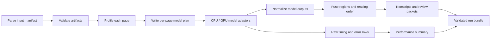

# newspaper-parsing

[](https://github.com/saulrichardson/newspaper-parsing/actions/workflows/ci.yml)

Manifest-driven infrastructure for newspaper layout detection, OCR model
bagging, region fusion, transcript construction, and quality review. The
`newsbag` package turns a page-image manifest into a validated run bundle with
per-model outputs, fused pages, transcripts, provenance, execution errors, and
performance reports.

The orchestration layer is model-agnostic. Built-in deterministic adapters make
the full contract testable on a laptop; command adapters connect the same
pipeline to PaddleOCR, Dell/American Stories, MinerU, local vision-language
models, or other CPU/GPU executables. No hosted model or API key is required.

## Core Properties

- **Plan before execution.** Every page is profiled and assigned an explicit,
  auditable model plan before expensive work starts.
- **One normalized model contract.** Layout and OCR backends emit the same
  region, runtime, and provenance structure.
- **Configurable routing.** Profiles select model bags; page-complexity filters
  decide which members run on each page.
- **Failure isolation.** One failed adapter does not discard outputs from the
  rest of the page's model bag.
- **Evidence-preserving fusion.** Fused regions and transcripts retain their
  source-model identities and disagreement signals.
- **Measured execution.** Raw timing rows and aggregate reports reconcile
  planned, observed, successful, failed, missing, and unexpected invocations.
- **HPC-native validation.** The repository includes a scheduler-backed NYU
  Torch canary with predictable scratch paths and structured status output.

## Architecture


```mermaid
flowchart LR
  A["Parse input manifest"] --> B["Validate artifacts"]
  B --> C["Profile each page"]
  C --> D["Write per-page model plan"]
  D --> E["CPU / GPU model adapters"]
  E --> F["Normalize model outputs"]
  F --> G["Fuse regions and reading order"]
  G --> H["Transcripts and review packets"]
  H --> I["Validated run bundle"]
  E --> J["Raw timing and error rows"]
  J --> K["Performance summary"]
  K --> I
```

Acquisition and parsing communicate only through the parse-input manifest.
Downstream systems consume fused-page and transcript artifacts rather than
private paths or parser-specific output formats.

## Install

Python 3.10 or newer is required.

```bash
python -m venv .venv
source .venv/bin/activate
python -m pip install --upgrade pip
python -m pip install -e ".[dev]"
```

Optional model stacks are intentionally separate from the orchestration core:

```bash
python -m pip install -e ".[paddle]"
python -m pip install -e ".[dell]"
python -m pip install -e ".[mineru]"
```

## Input Contract

The input is JSON Lines with one stable page ID per image. Relative image paths
are resolved against the manifest directory.

```json
{
  "page_id": "issue-1958-06-20-p035",
  "image_path": "/data/pages/issue-1958-06-20-p035.png",
  "issue_id": "issue-1958-06-20",
  "page_number": 35,
  "checksum_sha256": "<64-character digest>",
  "source": {
    "source_system": "newspapers_com",
    "source_id": "source-page-id"
  }
}
```

Validate before scheduling model work:

```bash
newsbag validate-parse-input-manifest \
  --manifest /path/to/parse_input.jsonl \
  --require-files \
  --require-checksums \
  --verify-checksums
```

## Plan A Model Bag

Planning profiles every page and writes `manifests/model_plan.jsonl` without
executing adapters:

```bash
newsbag plan-bagging \
  --manifest /path/to/parse_input.jsonl \
  --run-dir /tmp/newsbag_plan \
  --profile adaptive \
  --config configs/bagging.command.example.json
```

Each plan row records the page profile, estimated complexity, selected models,
resource classes, and routing reason. A command adapter can opt into any
combination of `easy`, `medium`, and `hard` pages:

```json
{
  "include_builtin_adapters": false,
  "command_adapters": [
    {
      "model_id": "layout_fast_v1",
      "family": "layout",
      "resource_class": "cpu",
      "profiles": ["adaptive", "full"],
      "complexities": ["easy", "medium", "hard"],
      "command": [
        "{python}",
        "scripts/my_layout_adapter.py",
        "--image-path", "{image_path}",
        "--output-json", "{output_path}"
      ]
    },
    {
      "model_id": "ocr_expensive_v1",
      "family": "ocr",
      "resource_class": "gpu",
      "profiles": ["adaptive", "full"],
      "complexities": ["hard"],
      "command": ["local-ocr-runner", "{image_path}", "{output_path}"]
    }
  ]
}
```

Model choices remain configuration, not orchestration policy. This allows
benchmarks to change the model bag without changing page, fusion, transcript,
or run-bundle contracts.

## Execute And Validate

Run the complete lightweight pipeline locally or register real model commands
through a config:

```bash
newsbag bagging-canary \
  --manifest /path/to/parse_input.jsonl \
  --run-dir /tmp/newsbag_run \
  --profile full

newsbag validate-run \
  --run-dir /tmp/newsbag_run \
  --output-json /tmp/newsbag_run/reports/validation.json
```

Rebuild the performance aggregate from immutable raw timing rows:

```bash
newsbag summarize-performance --run-dir /tmp/newsbag_run
```

The built-in `baseline`, `adaptive`, and `full` profiles use deterministic CPU
adapters. They validate orchestration and contracts; they are not presented as
production OCR quality baselines.

## Run Bundle

```text
RUN_DIR/
  summary.json
  provenance.json
  errors.jsonl
  manifests/
    parse_input.jsonl
    model_plan.jsonl
  profiles/
    <page_id>.json
  outputs/
    model_outputs/<model_id>/<page_id>.json
    fused_pages/<page_id>.json
    transcripts/<page_id>.txt
  review/
    <page_id>.md
  reports/
    input_manifest_validation.json
    plan_summary.json
    performance.json
    performance.jsonl
    performance_summary.json
    validation.json
```

`newsbag validate-run` cross-checks the input copy, per-page plan, successful
model outputs, failed adapters, fused model provenance, transcript bytes,
region geometry, headline counters, raw timing coverage, aggregate performance,
and provenance. Artifact references in `summary.json` are relative to the run
root, so the bundle can be moved as a directory; references that escape that
root are rejected. A run with execution errors remains inspectable but
validates as an error.

## Adapter Contract

Command templates can use `{python}`, `{page_id}`, `{image_path}`, `{image_dir}`,
`{image_name}`, `{image_stem}`, `{manifest_dir}`, `{profile_path}`,
`{output_path}`, `{run_dir}`, `{repo_root}`, `{model_id}`, `{width}`, and
`{height}`. The command writes JSON to `{output_path}` or emits one JSON object
on stdout.

```json
{
  "page_id": "issue-1958-06-20-p035",
  "model_id": "layout_fast_v1",
  "regions": [
    {
      "bbox_xyxy": [20, 30, 220, 90],
      "label": "text",
      "confidence": 0.91,
      "text": "recognized text",
      "reading_order": 1
    }
  ]
}
```

Legacy normalized Paddle, Dell, and MinerU outputs can be wrapped without
rerunning inference. See [Parser bagging](docs/parser_bagging_refactor.md) for
the converter and legacy-run discovery commands.

## Torch Canary

The submitter syncs the repository to
`/scratch/$USER/codex_hpc/parser_bagging`, installs the core package in a small
virtual environment, submits a Slurm job, validates the resulting bundle, and
prints `slurm_status.json`:

```bash
bash scripts/submit_torch_bagging_canary.sh
```

Useful controls:

```bash
bash scripts/submit_torch_bagging_canary.sh --profile baseline --plan-only
bash scripts/submit_torch_bagging_canary.sh --profile adaptive --no-wait
bash scripts/submit_torch_bagging_canary.sh --skip-sync --timeout 1200
bash scripts/submit_torch_bagging_canary.sh \
  --profile command_fixture \
  --config configs/bagging.command.fixture.json
```

GPU runner and split-stage examples live under `torch/slurm/`. Torch-specific
environment notes are in [Torch HPC](docs/torch_hpc.md).

## Development

```bash
python -m compileall -q src
pytest -q
python -m build
```

The active core has no network or hosted-model dependency. Tests use tiny
generated images and subprocess fixtures, so contract and failure behavior can
be verified in CI without downloading model weights.
