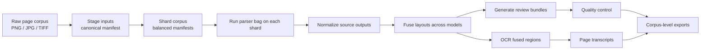
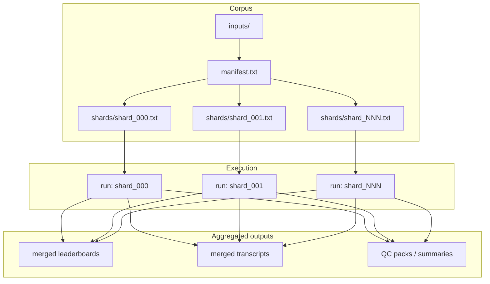
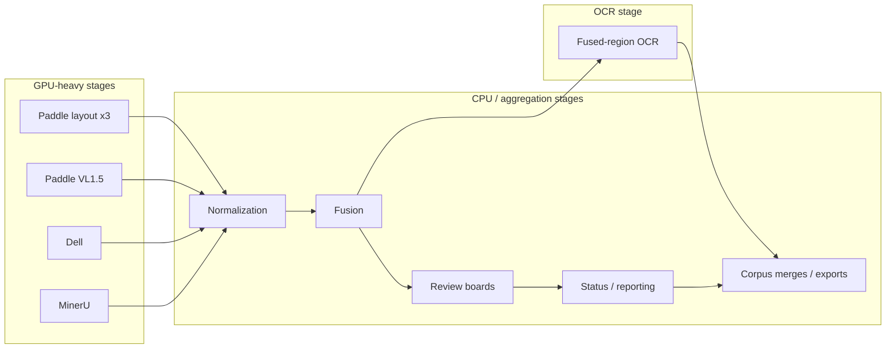

# newspaper-parsing

Corpus-scale newspaper page parsing: run multiple layout parsers over large PNG/TIFF/JPG collections, fuse their outputs, generate visual review artifacts, and produce reading-order transcripts from fused regions.

This README describes the project as it should be organized and operated going forward. The main goal is a clean production pipeline for large page corpora, with clear boundaries between core parsing, cluster operations, and downstream experiments.

## What This Project Is

This project should be the production system for turning raw newspaper page images into structured parsing artifacts:

- normalized per-model layout outputs
- fused page layouts with source provenance
- visual review bundles for quality control
- OCR/transcription outputs aligned to fused regions
- corpus-level tables ready for downstream analysis

The active parsing stack today is:

- Paddle layout detectors: `PP-DocLayoutV2`, `PP-DocLayoutV3`, `PP-DocLayout_plus-L`
- Paddle VL parser: `doc_parser v1.5`
- Dell American Stories layout parser
- MinerU2.5 layout parser
- fusion, review, and fused-region transcription

## What This Project Should Not Be

This repo should not be the dumping ground for every downstream newspaper workflow.

The intended boundary is:

- this repo owns ingestion, parser execution, normalization, fusion, review, transcription, and corpus exports
- downstream analysis belongs in a separate analysis repo
- prompt benchmarking, ordinance extraction, and gateway-backed LLM experiments belong under `experiments/` here or in a separate repo entirely

## System At A Glance


```mermaid
flowchart LR
  A["Raw page corpus<br/>PNG / JPG / TIFF"] --> B["Stage inputs<br/>canonical manifest"]
  B --> C["Shard corpus<br/>balanced manifests"]
  C --> D["Run parser bag on each shard"]
  D --> E["Normalize source outputs"]
  E --> F["Fuse layouts across models"]
  F --> G["Generate review bundles"]
  F --> H["OCR fused regions"]
  G --> I["Quality control"]
  H --> J["Page transcripts"]
  I --> K["Corpus-level exports"]
  J --> K
```

The important design choice is that the project is not "one parser." It is a bagged parsing system optimized for recall, inspection, and reproducible reruns.

## Large-Corpus Operating Model

This project should treat a large corpus as a first-class object, not just a folder passed to an ad hoc script.


```mermaid
flowchart TB
  subgraph Corpus["Corpus"]
    A["inputs/"] --> B["manifest.txt"]
    B --> C["shards/shard_000.txt"]
    B --> D["shards/shard_001.txt"]
    B --> E["shards/shard_NNN.txt"]
  end

  subgraph Execution["Execution"]
    C --> R1["run: shard_000"]
    D --> R2["run: shard_001"]
    E --> R3["run: shard_NNN"]
  end

  subgraph Outputs["Aggregated outputs"]
    R1 --> X["merged leaderboards"]
    R2 --> X
    R3 --> X
    R1 --> Y["merged transcripts"]
    R2 --> Y
    R3 --> Y
    R1 --> Z["QC packs / summaries"]
    R2 --> Z
    R3 --> Z
  end
```

For corpus-scale work, the project should support three levels of execution cleanly:

- corpus level: stage, shard, merge, export
- shard level: run one manifest through selected stages
- page level: inspect or reprocess failures without rerunning the world

## Target Architecture

The production pipeline should be organized around stages with a single shared artifact contract.


```mermaid
flowchart LR
  subgraph GPU["GPU-heavy stages"]
    A["Paddle layout x3"]
    B["Paddle VL1.5"]
    C["Dell"]
    D["MinerU"]
  end

  subgraph CPU["CPU / aggregation stages"]
    E["Normalization"]
    F["Fusion"]
    G["Review boards"]
    H["Status / reporting"]
    I["Corpus merges / exports"]
  end

  subgraph OCR["OCR stage"]
    J["Fused-region OCR"]
  end

  A --> E
  B --> E
  C --> E
  D --> E
  E --> F
  F --> G
  F --> J
  G --> H
  J --> I
  H --> I
```

### Core principles

- One production package: `newsbag`
- One operational CLI: all primary workflows should be reachable through `newsbag ...`
- One run contract: every stage writes predictable outputs under a run root
- One source of truth for variant IDs, artifact paths, and stage names
- Shard-friendly execution: every stage should work on a manifest, not on implicit directory scans
- Fast failure: empty external outputs, missing inputs, and broken configs should fail loudly

## Target Repo Layout

The repo should be organized by responsibility, not by historical script accumulation.

```text
newspaper-parsing/
  src/newsbag/
    cli/
      main.py
      stage_inputs.py
      run.py
      status.py
      merge.py
      export.py
    core/
      config.py
      labels.py
      manifest.py
      paths.py
      io.py
      proc.py
      variants.py
    stages/
      paddle_layout.py
      paddle_vl15.py
      dell.py
      mineru.py
      fusion/
        geometry.py
        heuristics.py
        metrics.py
        stage.py
      review/
        ranking.py
        boards.py
        stage.py
      transcription/
        ocr.py
        assignment.py
        render.py
        stage.py
  configs/
  ops/
    torch/
      slurm/
      submit/
  experiments/
    ordinance_llm/
      prompts/
      scripts/
      reference/
  docs/
  tests/
    unit/
    integration/
  third_party/
    agent-gateway/
```

### Why this shape is better

- `src/newsbag/` stays focused on the production parser bagging pipeline
- `ops/torch/` isolates cluster-specific submission logic from the parsing code
- `experiments/` makes downstream prompt work explicit instead of mixing it into production entrypoints
- `third_party/` makes vendored dependencies obvious and keeps them out of the mental model of the parsing package
- `core/variants.py` becomes the single place to define fusion variants and stage IDs

## Target CLI Surface

The operational surface should be simple and complete:

```bash
newsbag stage-inputs
newsbag shard-manifest
newsbag run
newsbag status
newsbag merge-runs
newsbag export
```

Each command should have one clear job:

- `stage-inputs`: normalize file, directory, archive, and manifest inputs into a canonical image manifest
- `shard-manifest`: split a corpus manifest into balanced shard manifests
- `run`: execute one shard or one manifest through selected stages
- `status`: summarize progress and missing artifacts for a run or corpus
- `merge-runs`: combine shard outputs into corpus-level outputs
- `export`: emit downstream-friendly datasets and summary tables

This is the correct abstraction for large PNG corpora. Raw helper scripts can still exist, but only as thin wrappers over package code or ops tooling.

## Desired Artifact Contract

The pipeline should produce predictable, composable outputs.

### Corpus-level

```text
corpora/<corpus_name>/
  manifest.txt
  shards/
    shard_000.txt
    shard_001.txt
  aggregates/
    variant_leaderboard.tsv
    source_leaderboard.tsv
    transcripts_combined.txt
    qc_summary.json
```

### Run-level

```text
runs/<corpus_name>/<shard_name>/
  manifests/
  logs/
  reports/
  outputs/
    sources/
    fusion/
    transcription/
  review/
```

### Page-level

Each page should be inspectable through stable, predictable artifacts:

- source model normalized boxes
- fused boxes and metrics
- review overlays and comparison boards
- OCR raw output
- transcript box assignments
- final transcript text

## What Matters Most For Large PNG Corpora

If the priority is leveraging full functionality at scale, these capabilities matter most:

1. Canonical manifest staging from mixed inputs.
2. Manifest sharding as a first-class operation.
3. Reproducible run directories with resolved configs saved inside them.
4. Stage-selective reruns without breaking artifact contracts.
5. Corpus-level merge/export commands so shard outputs become one coherent dataset.
6. Clear status reporting for partial failures and missing pages.

Without those six pieces, the project stays usable for small batches but becomes fragile for real corpora.

## What Already Exists And Should Be Preserved

The current codebase already has the right core ideas:

- manifest-based execution
- separate parser runners
- explicit fusion variants
- review bundle generation
- fused-region transcription
- Torch-oriented split GPU execution

Those are the assets to keep. The main change is organizational: make the production path obvious, and move experiment-specific code out of the critical path.

## Near-Term Refactor Priorities

The highest-value cleanup sequence is:

1. Consolidate all primary entrypoints under `newsbag`.
2. Extract shared path and variant registries into `src/newsbag/core/`.
3. Split large stage modules into stage packages with smaller files.
4. Move ordinance / LLM experiment code under `experiments/ordinance_llm/`.
5. Move cluster scripts under `ops/torch/`.
6. Add corpus-level merge and export commands.

## Related Docs

- [`docs/output_layout.md`](docs/output_layout.md): current run artifact layout
- [`docs/torch_hpc.md`](docs/torch_hpc.md): Torch cluster operating guidance

## Current Status

This repository already runs the full parser bagging flow today. The remaining work is to make the intended architecture explicit in code and docs so the whole system scales cleanly to very large newspaper corpora.
