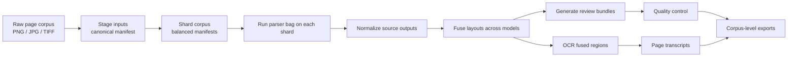
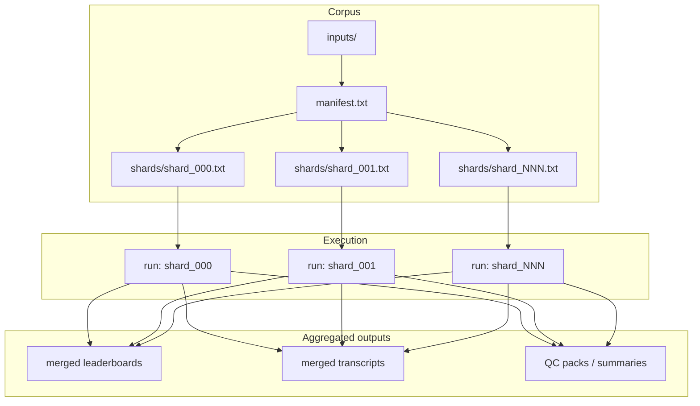
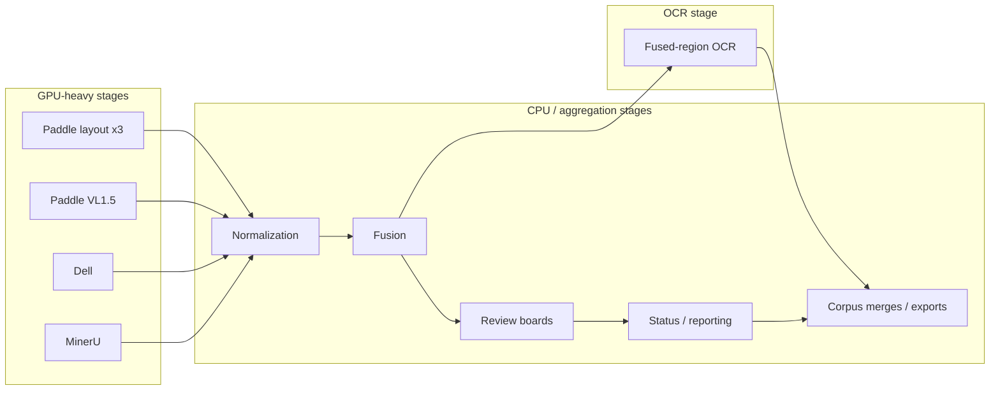
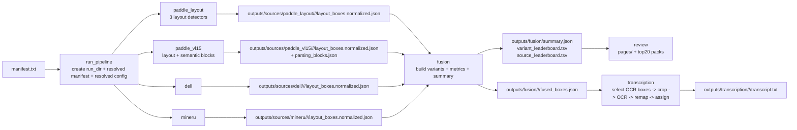

# newspaper-parsing

Corpus-scale newspaper page parsing: run multiple layout parsers over large PNG/TIFF/JPG collections, fuse their outputs, generate visual review artifacts, and produce reading-order transcripts from fused regions.

## Scope

This project turns raw newspaper page images into structured parsing artifacts:

- normalized per-model layout outputs
- fused page layouts with source provenance
- visual review bundles for quality control
- OCR/transcription outputs aligned to fused regions
- corpus-level tables ready for downstream analysis

Project boundary:

- this repo owns ingestion, parser execution, normalization, fusion, review, transcription, and corpus exports
- downstream analysis belongs in a separate analysis repo
- prompt benchmarking, ordinance extraction, and gateway-backed LLM experiments belong under `experiments/` here or in a separate repo

## Active Stack

Active parsing stack:

- Paddle layout detectors: `PP-DocLayoutV2`, `PP-DocLayoutV3`, `PP-DocLayout_plus-L`
- Paddle VL parser: `doc_parser v1.5`
- Dell American Stories layout parser
- MinerU2.5 layout parser
- fusion, review, and fused-region transcription

## System At A Glance


```mermaid
flowchart LR
  A["Raw page corpus<br/>PNG / JPG / TIFF"] --> B["Stage inputs<br/>canonical manifest"]
  B --> C["Shard corpus<br/>balanced manifests"]
  C --> D["Run parser bag on each shard"]
  D --> E["Normalize source outputs"]
  E --> F["Fuse layouts across models"]
  F --> G["Generate review bundles"]
  F --> H["OCR fused regions"]
  G --> I["Quality control"]
  H --> J["Page transcripts"]
  I --> K["Corpus-level exports"]
  J --> K
```

The project is a parser bagging system optimized for recall, inspection, and reproducible reruns.

## Large-Corpus Operating Model

Use the corpus as a first-class object.


```mermaid
flowchart TB
  subgraph Corpus["Corpus"]
    A["inputs/"] --> B["manifest.txt"]
    B --> C["shards/shard_000.txt"]
    B --> D["shards/shard_001.txt"]
    B --> E["shards/shard_NNN.txt"]
  end

  subgraph Execution["Execution"]
    C --> R1["run: shard_000"]
    D --> R2["run: shard_001"]
    E --> R3["run: shard_NNN"]
  end

  subgraph Outputs["Aggregated outputs"]
    R1 --> X["merged leaderboards"]
    R2 --> X
    R3 --> X
    R1 --> Y["merged transcripts"]
    R2 --> Y
    R3 --> Y
    R1 --> Z["QC packs / summaries"]
    R2 --> Z
    R3 --> Z
  end
```

Corpus-scale execution has three levels:

- corpus level: stage, shard, merge, export
- shard level: run one manifest through selected stages
- page level: inspect and reprocess failures

## Target Architecture

The production pipeline uses stages with a shared artifact contract.


```mermaid
flowchart LR
  subgraph GPU["GPU-heavy stages"]
    A["Paddle layout x3"]
    B["Paddle VL1.5"]
    C["Dell"]
    D["MinerU"]
  end

  subgraph CPU["CPU / aggregation stages"]
    E["Normalization"]
    F["Fusion"]
    G["Review boards"]
    H["Status / reporting"]
    I["Corpus merges / exports"]
  end

  subgraph OCR["OCR stage"]
    J["Fused-region OCR"]
  end

  A --> E
  B --> E
  C --> E
  D --> E
  E --> F
  F --> G
  F --> J
  G --> H
  J --> I
  H --> I
```

### Core principles

- Production package: `newsbag`
- Operational CLI: `newsbag ...`
- Shared run contract
- Shared stage and variant registry
- Manifest-driven execution
- Fail-fast stage behavior

## How One Run Actually Works

One run has a concrete internal artifact flow:


```mermaid
flowchart LR
  M["manifest.txt"] --> P["run_pipeline<br/>create run_dir + resolved manifest + resolved config"]

  P --> PL["paddle_layout<br/>3 layout detectors"]
  P --> PV["paddle_vl15<br/>layout + semantic blocks"]
  P --> DE["dell"]
  P --> MI["mineru"]

  PL --> PLN["outputs/sources/paddle_layout/<variant>/<slug>/layout_boxes.normalized.json"]
  PV --> PVN["outputs/sources/paddle_vl15/<variant>/<slug>/layout_boxes.normalized.json<br/>+ parsing_blocks.json"]
  DE --> DEN["outputs/sources/dell/<variant>/<slug>/layout_boxes.normalized.json"]
  MI --> MIN["outputs/sources/mineru/<variant>/<slug>/layout_boxes.normalized.json"]

  PLN --> FU["fusion<br/>build variants + metrics + summary"]
  PVN --> FU
  DEN --> FU
  MIN --> FU

  FU --> FS["outputs/fusion/summary.json<br/>variant_leaderboard.tsv<br/>source_leaderboard.tsv"]
  FU --> FV["outputs/fusion/<variant>/<slug>/fused_boxes.json"]

  FS --> RV["review<br/>pages/ + top20 packs"]
  FV --> TR["transcription<br/>select OCR boxes -> crop -> OCR -> remap -> assign"]
  TR --> TO["outputs/transcription/<variant>/<slug>/transcript.txt"]
```

### 1. Run bootstrap

Before model execution, the pipeline:

- reads and validates every path in the manifest
- creates a run root with `manifests/`, `logs/`, `reports/`, `outputs/`, and `review/`
- writes `manifests/images.resolved.txt`
- writes `manifests/config.resolved.json`

### 2. Source runners and normalization

Every parser stage writes raw outputs and then rewrites them into one normalized box schema.

- `paddle_layout` runs three layout detectors and writes raw Paddle outputs plus `layout_boxes.normalized.json`
- `paddle_vl15` writes both normalized layout boxes and the full `parsing_blocks.json` semantic payload
- `dell` and `mineru` run as external stages, then normalize their raw boxes into the same schema as Paddle
- each source family also writes label histograms so you can inspect raw-vs-normalized label distributions at run level

Shared normalized box contract:

```json
{
  "source_family": "paddle|dell|mineru",
  "source_model": "variant_id",
  "source_label": "raw model label",
  "norm_label": "text|title|table|image|other",
  "bbox_xyxy": [x1, y1, x2, y2],
  "score": 0.0,
  "reading_order": null,
  "text": null
}
```

Fusion, review, and transcription consume normalized boxes only.

### 3. Fusion internals

Fusion builds variants, denoises boxes, and scores results.

For each page, the current implementation does this:

- loads normalized boxes from each Paddle variant, Dell, and MinerU
- selects the best single Paddle variant for the page
- forms the Paddle union across the three layout detectors plus VL1.5
- derives consensus pseudo-lines from text/title-like boxes across all sources
- builds a base raster mask from consensus-worthy candidates
- evaluates seven named fusion variants: `S1_paddle_best_single`, `S2_dell_only`, `S3_mineru_only`, `P1_paddle_union4`, `P2_paddle_union4_plus_dell`, `P3_paddle_union4_plus_mineru`, `P4_paddle_union4_plus_dell_plus_mineru`
- dedupes and denoises candidate boxes before scoring them

Denoising suppresses giant unsupported text strips and can replace weak giant boxes with smaller synthetic recovery boxes around uncovered pseudo-lines. This keeps recall high while limiting noisy boxes.

Each variant is scored with metrics written per page and aggregated at run level:

- `base_recall_ratio`
- `line_coverage_ratio`
- `text_area_ratio`
- `box_count`

Run summary records:

- `best_variant_by_score`
- `recommended_variant`

Recommendation uses the configured preferred variant when present. Otherwise it falls back to the best-scoring variant.

### 4. Review internals

Review writes page-level QA artifacts.

For each rendered page, the review bundle writes:

- the original page
- each Paddle source overlay
- a dedicated Paddle-only comparison board
- Dell and MinerU overlays
- the recommended fused overlay
- an explicit `P2` vs `P4` board showing the effect of adding MinerU

There are two review modes:

- `all`: render every page
- `top20`: render only the most informative pages and the strongest MinerU-delta pages

### 5. Transcription internals

Transcription is ROI-first.

For the selected fused variant, the stage:

- loads fused boxes for the page
- keeps only configured labels, usually `text` and `title`
- dedupes those fused boxes down to compact OCR regions
- crops each OCR region out of the original page
- runs Paddle OCR over the crop directory
- parses crop-level OCR lines
- translates each OCR line back into page coordinates
- assigns remapped OCR lines back into the fused reading-order boxes
- writes `transcript_boxes.json`, `transcript.txt`, and `transcript_combined.txt`

Key transcription design choices:

- fusion decides where OCR should happen
- OCR runs on cropped fused regions
- transcript text follows fused region order

### 6. Stage dependency model

Stage dependency model:

- `paddle_layout`, `paddle_vl15`, `dell`, and `mineru` can run independently from the same manifest
- `fusion` depends on normalized source outputs
- `review` and `transcription` depend on `outputs/fusion/summary.json`
- `review` and `transcription` rerun from existing fusion outputs when `outputs/fusion/summary.json` already exists

This partial rerun model separates expensive GPU inference from downstream inspection and OCR work.

## Target Repo Layout

Organize the repo by responsibility.

```text
newspaper-parsing/
  src/newsbag/
    cli/
      main.py
      stage_inputs.py
      run.py
      status.py
      merge.py
      export.py
    core/
      config.py
      labels.py
      manifest.py
      paths.py
      io.py
      proc.py
      variants.py
    stages/
      paddle_layout.py
      paddle_vl15.py
      dell.py
      mineru.py
      fusion/
        geometry.py
        heuristics.py
        metrics.py
        stage.py
      review/
        ranking.py
        boards.py
        stage.py
      transcription/
        ocr.py
        assignment.py
        render.py
        stage.py
  configs/
  ops/
    torch/
      slurm/
      submit/
  experiments/
    ordinance_llm/
      prompts/
      scripts/
      reference/
  docs/
  tests/
    unit/
    integration/
  third_party/
    agent-gateway/
```

### Why this shape works

- `src/newsbag/` stays focused on the production parser bagging pipeline
- `ops/torch/` isolates cluster-specific submission logic from the parsing code
- `experiments/` keeps downstream prompt work separate from production entrypoints
- `third_party/` makes vendored dependencies obvious and keeps them out of the mental model of the parsing package
- `core/variants.py` becomes the single place to define fusion variants and stage IDs

## Target CLI Surface

CLI surface:

```bash
newsbag stage-inputs
newsbag shard-manifest
newsbag run
newsbag status
newsbag merge-runs
newsbag export
```

Each command should have one clear job:

- `stage-inputs`: normalize file, directory, archive, and manifest inputs into a canonical image manifest
- `shard-manifest`: split a corpus manifest into balanced shard manifests
- `run`: execute one shard or one manifest through selected stages
- `status`: summarize progress and missing artifacts for a run or corpus
- `merge-runs`: combine shard outputs into corpus-level outputs
- `export`: emit downstream-friendly datasets and summary tables

This abstraction fits large PNG corpora. Raw helper scripts can remain as thin wrappers over package code or ops tooling.

## Desired Artifact Contract

The pipeline produces predictable, composable outputs.

### Corpus-level

```text
corpora/<corpus_name>/
  manifest.txt
  shards/
    shard_000.txt
    shard_001.txt
  aggregates/
    variant_leaderboard.tsv
    source_leaderboard.tsv
    transcripts_combined.txt
    qc_summary.json
```

### Run-level

```text
runs/<corpus_name>/<shard_name>/
  manifests/
  logs/
  reports/
  outputs/
    sources/
    fusion/
    transcription/
  review/
```

### Page-level

Page-level artifacts:

- source model normalized boxes
- fused boxes and metrics
- review overlays and comparison boards
- OCR raw output
- transcript box assignments
- final transcript text

## Large-Corpus Priorities

Critical capabilities:

1. Canonical manifest staging from mixed inputs.
2. Manifest sharding as a first-class operation.
3. Reproducible run directories with resolved configs saved inside them.
4. Stage-selective reruns that preserve artifact contracts.
5. Corpus-level merge/export commands so shard outputs become one coherent dataset.
6. Clear status reporting for partial failures and missing pages.

These six capabilities keep large-corpus execution reproducible and operable.

## Current Assets

Current assets:

- manifest-based execution
- separate parser runners
- explicit fusion variants
- review bundle generation
- fused-region transcription
- Torch-oriented split GPU execution

Refactor around these assets. Keep the production path obvious and keep experiment-specific code out of the critical path.

## Near-Term Refactor Priorities

The highest-value cleanup sequence is:

1. Consolidate all primary entrypoints under `newsbag`.
2. Extract shared path and variant registries into `src/newsbag/core/`.
3. Split large stage modules into stage packages with smaller files.
4. Move ordinance / LLM experiment code under `experiments/ordinance_llm/`.
5. Move cluster scripts under `ops/torch/`.
6. Add corpus-level merge and export commands.

## Related Docs

- [`docs/output_layout.md`](docs/output_layout.md): current run artifact layout
- [`docs/torch_hpc.md`](docs/torch_hpc.md): Torch cluster operating guidance

## Current Status

The repository already runs the full parser bagging flow. The remaining work is to make the architecture explicit in code and docs so the system scales cleanly to very large newspaper corpora.
